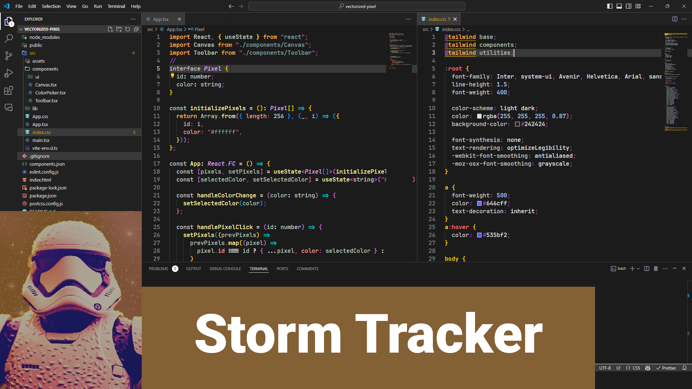

# Space Wars 🚀

A VSCode theme extension that immerses you in the epic universe of Space Wars. Transform your coding environment with themes inspired by legendary galactic figures. Experience the shades of Darth Invader, Luke Skywriter, and Storm Tracker as you code.

Space Wars offers a cohesive and immersive coding experience by harmonizing every element—from the sidebar to the integrated terminal—with your selected theme.


[](https://opensource.org/licenses/MIT)


## Usage 🚀

Switch between different themes to experience the unique ambiance each one brings to your coding environment. Preview the themes below to find your favorite!


<br></br>


<br></br>



<br></br>

## New Themes

<br></br>


<br></br>


<br></br>

## Table of Contents

- [Installation](#installation)
- [Recommended Font: JetBrains Mono](#recommended-font-jetbrains-mono)
  - [How to Install JetBrains Mono](#how-to-install-jetbrains-mono)
  - [Setting JetBrains Mono in VSCode](#setting-jetbrains-mono-in-vscode)
- [Special Instructions for Linux Users](#special-instructions-for-linux-users)
  - [Enabling Custom Components](#enabling-custom-components)
- [Features](#features)
- [Support](#support)
- [Contributing](#contributing)
- [License](#license)
- [Acknowledgments](#acknowledgments)
- [Changelog](#changelog)
- [FAQs](#faqs)
- [Contact](#contact)

## Installation 💾

1. Open the Extensions sidebar in VSCode. `View → Extensions`.
2. Search for `Space Wars`, and install it.
3. After installation, select the theme by navigating to `File → Preferences → Color Theme → Space Wars`.

### 🌌 Quick Theme Change in VSCode 🎹

To enhance your coding experience with Space Wars, follow these easy steps:

1. **Open Command Palette**: Press `Ctrl+Shift+P` (Windows/Linux) or `Cmd+Shift+P` (macOS) to bring up the Command Palette.

2. **Choose Theme**: Type `Preferences: Color Theme` and hit `Enter`. This action will take you directly to the theme selection menu.

3. **Select Space Wars**: Scroll through the list or type the name of your desired Space Wars theme (like Darth Invader or Storm Tracker) and press `Enter` to apply it.

### 🕹️ Quick Shortcut

For an even quicker theme change:

- Press `Ctrl + K`, then `Ctrl + T`.
- This key combination instantly opens the theme selection menu. Choose your desired Space Wars theme from the dropdown.

## Recommended Font: JetBrains Mono ✍️

To elevate your coding experience with Space Wars, we recommend using the JetBrains Mono font. This font is designed specifically for developers, offering improved readability and a modern, clean aesthetic that complements the theme's styles.

### How to Install JetBrains Mono

1. Download the latest version of JetBrains Mono from the [official website](https://www.jetbrains.com/lp/mono/).
2. Unzip the downloaded archive.
3. Install the font on your system:
   - **Windows**: Right-click on the `.ttf` files and select "Install".
   - **macOS**: Double-click on the `.ttf` files and press "Install Font".
   - **Linux**: Place the `.ttf` files into `~/.local/share/fonts` (or `/usr/share/fonts` to install fonts system-wide) and run `fc-cache -f -v`.

### Setting JetBrains Mono in VSCode

After installing the font, set it as your editor's font in VSCode:

1. Open VSCode settings (`Ctrl + ,` or `Cmd + ,` on macOS).
2. Search for `Font Family`.
3. Enter `JetBrains Mono` as the first choice in the font list.
4. Ensure `Editor: Font Ligatures` is enabled to enjoy the full visual experience.

Below are some recommended settings:

```json
 "editor.fontFamily": "'JetBrains Mono', 'Courier New', monospace",
 "editor.fontLigatures": true,
```

## Special Instructions for Linux Users 🐧

For Linux users, to fully experience the Space Wars theme as intended, you may need to enable certain features manually due to differences in how themes interact with the VSCode UI on Linux.

### Enabling Custom Components

1. Open the Command Palette with `Ctrl+Shift+P`.
2. Type `Preferences: Open Settings (JSON)` and press `Enter`.
3. Add or modify the following setting:

   ```json
   "window.titleBarStyle": "custom"
   ```

4. Save the settings and restart VSCode.

## Features 🌟

Space Wars is a collection of themes inspired by legendary galactic characters. Each theme offers a unique coding ambiance to enhance your VSCode experience.

## Support 🛠️

Encountered a bug or have a suggestion? Open an issue [here](https://github.com/entropy-glitch/pixel-wars/issues) and we'll look into it.

## Contributing 🤝

We welcome contributions from the community! If you'd like to contribute, feel free to fork the repository and submit a pull request. For major changes, please open an issue first to discuss what you would like to change.

## License ⚖️

This project is licensed under the MIT License - see the [LICENSE](LICENSE) file for details.

## Acknowledgments 🙏

Special thanks to the galactic themes that inspired the color palettes of Space Wars.

## Changelog 📝

v.1.0.0

- Initial release

v.1.0.1

- Updated images for the themes

v.1.1.0

- Updated the md file for better user experience

v.1.1.1

- Updated Vader Theme, optimized for Cursor and changed minor aesthetics.

v.1.1.2

- Updated Vader Theme, Storm Tracker, optimized for Cursor Editor and changed minor aesthetics.

v.1.1.3

- Reworked the Luke Skywriter theme to be more in line with the theme aesthetics.

v.1.1.4

- Added two more character themes: Darth Insidious and Yodan

v.1.1.5

- Deleted routes for future projects

v.1.1.6

- Improved the menu selection for the Darth Insidious and the Yodan character theme

## FAQs ❓

- **How do I switch between different themes?**
  - Navigate to `File → Preferences → Color Theme` and select your desired theme from Space Wars.

## Contact

Feel free to reach out on [GitHub](https://github.com/entropy-glitch).
